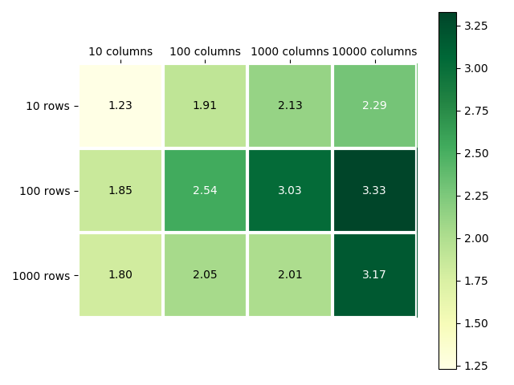
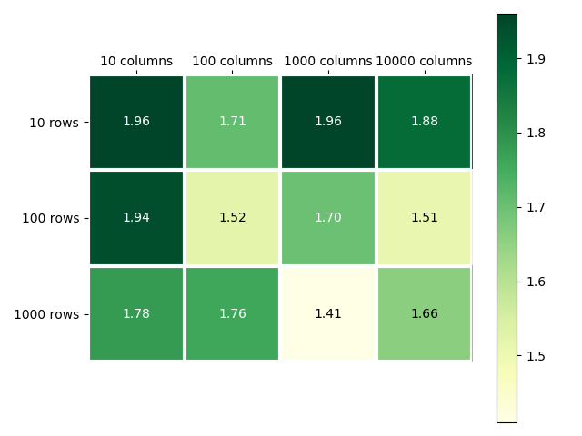

# Fast matrix transposition using Intel's vectorization intrinsics

A small "case study" I did during my internship at AVL-AST @ Zagreb. The goal was to see if it is possible to reduce matrix transposition time by using Streaming SIMD Extensions (up to SSE2) in form of intrinsics. The official Intel's intrinsics reference guide I used for this project is available [here](https://software.intel.com/sites/landingpage/IntrinsicsGuide/#).

## Building and running

### Prerequisites

To build this project you need:
  - compiler that supports the C++17 standard
  - access to Intel's intrinsic headers, such as `emmintrin.h`

Requirements for running the build:
  - a processor that supports the SSE2 instruction set, if you have a 64bit processor this requirement is probably met

### Building

The easiest way to build is using Microsoft's msbuild or a Visual Studio environment. Files related to the algorithm implementation are in the root folder of this repository along with some tests, while the source files related to benchmarking are in the benchmarkng subfolder. To build the whole solution with msbuild in the command line see the following: `msbuild matrices.sln /p:Configuration=Release /p:Platform=x64`. Release is the recommended configuration for running benchmarks.

### Running

The output files will be in subfolders named `x64` for each project. For the main project that holds the matrix implementation, the output executable runs some tests, while the benchmark executable runs a benchmark.

If you wish to change the dimension of the matrix or the type used in the benchmarks see [benchmarks/main.cpp](benchmarks/main.cpp#L76-L78). Upon finishing the benchmark program will output the average time it took for each of the algorithms, along with the standard deviation.

## Benchmarks

Transposition algorithm using SSE intrinsics was compared to a naive transposition algorithm in many row-column configurations that are relevant. Every configuration was benchmarked 1000 times while measuring the average time and the standard deviation to keep track for unexpected fluctuations (processor not holding boost frequency consistently, background tasks and etc.). Only the algorithm itself was measured, meaning no memory allocations were taken into consideration.

Benchmarking was done using a 64bit build in release configuration.

### Speedup ratio for matrices using a 32bit data type (ie. a float)

Using SSE/SSE2 intrinsics it is possible to work with 128bit data types. When using matrices with contiguous storage, we can read 4 32bit data types and also write them in a single instruction. With this in mind, the algorithm works by taking submatrices of 4x4 floats by doing 4 reads of 128bit data, transposing it by shuffling bytes, and then doing 4 writes of 128bit data. That is 4 reads and 4 writes compared to 16 reads and writes in the naive algorithm. This means the theoretical speedup is 4 times. However, some processing time is used to shuffle the bytes in the 4x4 matrix, so the maximum observed speedup is a bit over 3 times in the best case. Note that the worst case scenario still has some significant speedup (atleast on 64bit builds).

### Speedup ratio for matrices using a 64bit data type (ie. a double)

We can pack 2 64bit types in the 128bit data type. Similar to the above algorithm, we work with 2x2 submatrices. This means in each iteration we have 2 reads and 2 writes, along wih some shuffling logic. Theoretically, this should be two times faster than the naive algorithm which does 4 reads and 4 writes for the submatrix of the same size. We do in fact notice a more stable speedup, as opposed to when using a 32bit data type. Furthermore, the maximum speedup is closer to the theoretical speed of 2x, when compared to the algorithm that works on 32bit data types. This is mainly because the shuffling logic is much less complex when we have a 2x2 submatrix, as opposed to a 4x4 submatrix, and on top of that less registers are used (temporary variables in the algorithm).

## Acknowledgements

Special thanks to Nebojša Vujnović for assigning me this task and guiding me trough it.